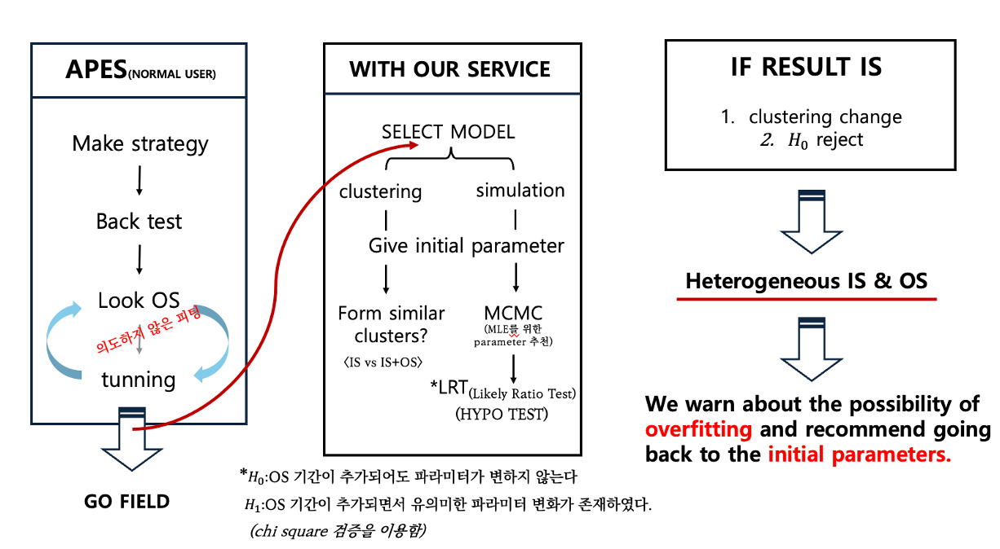

# GBM(Geometric Brownian Motion),MCMC(Markov chain Monte carlo Simulation),LRT(Likelihood Ratio Test)를 활용한 regime 분석 (Done)
---

## 목차 (Table of Contents)

1. [프로젝트 소개 (Introduction)](#프로젝트-소개-introduction)  
2. [프로젝트 핵심 (Point)](#프로젝트-핵심-Point)  
3. [프로젝트 구조 (Project-Structure)](#프로젝트-구조-project-structure) 

---
## 프로젝트 소개 (Introduction)
- **형식:**
  학회 프로젝트
- **주최:**
  KHUDA(Kyeong hee University Data analysis)
- **역할:** Team leader, 아이디어 제시, 코드 작성

## 프로젝트 핵심 (Point)

- **문제 상황**:
  - 금융 시장은 계속해서 변화한다. 이때 현재 시장이 변했는지 확인하는 것은 굉장히 중요하고 어려운 문제이다. 해당 변화를 종종 체체전환(regime change)라고 한다.
- **가설**
  - 기하브라운운동(GBM)은 기초자산 가격을 수리적으로 모델링할 수 있게 해준다. GBM은 확률과정이지만 해당 확률 과정을 확률밀도함수(PDF)로 전개할 수 있다.
    만약 과거시장과 현재 시장이 다르다면 MCMC로 추론한 GBM의 PDF의 파라미터가 우도비검정(LRT)로 기각되지 않을까?

## 프로젝트 구조 (Project structure)

